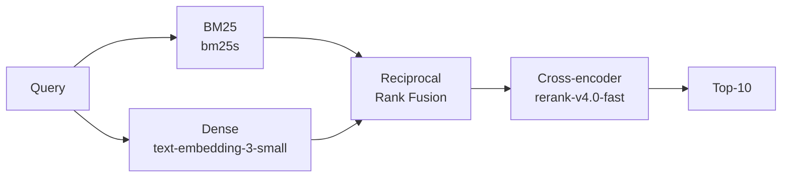

# Hybrid RAG From Scratch

A hybrid retrieval pipeline: BM25 for keyword matching, dense embeddings for paraphrase, Reciprocal Rank Fusion to combine them, and a cross-encoder reranker on the top candidates. It is evaluated with NDCG@10 on [FiQA-2018](https://sites.google.com/view/fiqa), a financial Q&A benchmark with labeled ground truth.

## The pipeline



## Quick start

```bash
uv sync                  # install dependencies and the semantic-rag package
cp .env.example .env     # then fill in your API keys
```

Two API keys are required in `.env`:

- `OPENAI_API_KEY` — for the `text-embedding-3-small` embeddings
- `COHERE_API_KEY` — for the `rerank-v4.0-fast` reranker

```bash
# 1. Download the FiQA dataset from Hugging Face into data/
uv run data/download_fiqa.py

# 2. Build the indexes (offline, done once)
uv run src/indexing/bm25.py
uv run src/indexing/embed.py 

# 3. Evaluate all four methods with NDCG@10
uv run evaluate.py
```

## Results

`evaluate.py` scores all four methods with NDCG@10 and Recall@50 on the FiQA test set. Reference results on 50 sampled queries:

```
NDCG@10 x100 on FiQA (50 sampled test queries)
------------------------------------------
  BM25                   28.01
  Dense                  40.06
  Hybrid (RRF)           33.72
  Hybrid + Rerank        47.28

Recall@50 of the hybrid candidate pool: 63.61
```

### Key findings

- **Dense beats BM25 by a wide margin (40.06 vs 28.01).** FiQA questions are paraphrase-heavy, so lexical overlap is a weak signal and embeddings carry most of the retrieval quality.
- **RRF fusion actually *hurts* here (33.72 < 40.06).** This is the interesting result: vanilla RRF weights both retrievers equally, so the much weaker BM25 ranking drags the strong dense ranking down. Fusion only pays off when the two retrievers are closer in quality or are weighted — on FiQA they are not.
- **The reranker is what carries the pipeline (+7.22 over dense, +13.56 over RRF).** A cross-encoder reads the full query–document pair instead of comparing precomputed vectors, and on these queries that re-scoring is where the real gain comes from. It also rescues the candidates that fusion mixed in, which is why running it on the fused pool still ends up well ahead of dense alone.
- **Retrieval coverage, not ranking, is the ceiling (Recall@50 = 63.61).** Only ~64% of relevant docs reach the 50-candidate pool, so the reranker never even sees the other ~36%. The reranker is excellent at ordering what it receives, but the candidate stage is what caps the whole pipeline — the highest-leverage place to improve next is recall (more candidates, a better retriever, or query expansion), not the reranker.

The takeaway is that stage quality depends on the data. On a benchmark where BM25 is weak, the honest move would be to drop or down-weight it in the fusion; the reranker consistently earns its place, but it can only rank what retrieval hands it.
